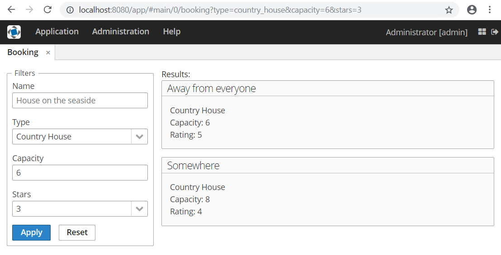

# CUBA Navigation & Routing sample

This project is intended for demonstration of basic concepts of URL Routing
feature:

1. How to register a route for screen
2. How to reflect some state to URL
3. How to handle URL params changing

## Basic usage

This section contains small code snippets describing how new features can be used.

### Registering a route for screen

To register a route for screen add `@Route` annotation to controller:

```java
@Route("my-screen")
public class MyScreen extends Screen {
}
```

### Reflecting state to URL

To reflect a state the `UrlRouting` component should be used. It has two main methods:

- `pushState(Screen screen)` - changes URL according the given screen and creates 
new entry in browser history
- `replaceState(Screen screen)` - replaces URL according the given screen, but 
does not create new entry in browser history

Example:
```java
@Route("my-screen")
public class MyScreen extends Screen {

    @Inject
    private UrlRouting urlRouting;
    
    private void changeUrl() {
        Map<String, String> params = ParamsMap.of(
                "param1", "value1",
                "param2", "value2");

        urlRouting.replaceState(this, params);
    }
}
```

URL will be changed to:

`localhost:8080/app/#main/0/my-screen?param1=value1&param2=value2`

### Handling URL params changing

Params changing can be handled with subscription for `UrlParamsChangedEvent` in
screen controller:

```java
@Route("my-screen")
public class MyScreen extends Screen {

    @Subscribe
    protected void onUrlParamsChanged(UrlParamsChangedEvent event) {
        Map<String, String> params = event.getParams();
        
        // do something
    }
}
```

It enables to preload some data or change screen controls state before screen
is shown (for example, when a screen is navigated with some params).

Open the following link when the sample is running to show hotels available for
booking with rating greater than "4":

[http://localhost:8080/app/#main/booking?type=hotel&stars=4](http://localhost:8080/app/#main/booking?type=hotel&stars=4) 


## Screenshot



## Issues
Please use https://www.cuba-platform.com/discuss for discussion, support, and
reporting problems corresponding to this sample.
